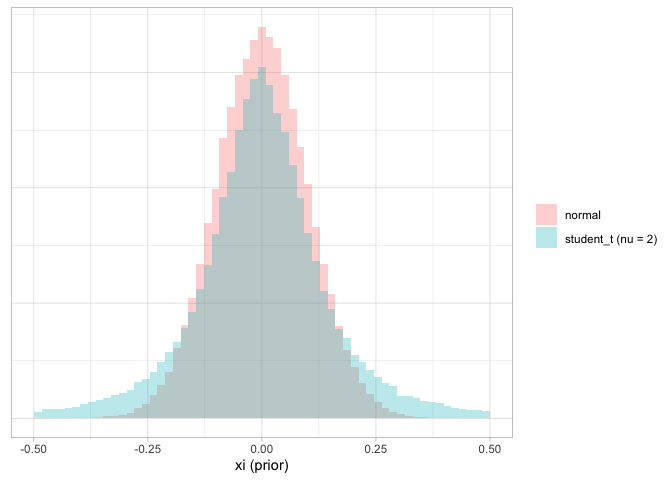

Polling errors and fat tails
================

To me it always felt like “fat tailed” errors was just another buzzword
as if throwing a student-t distribution with *ν* = 7 would magically
solve your problem of polling errors that put too little probability on
errors that are large. So here a test with some data.

To estimate polling errors I use the generic model

*y*<sub>*i*</sub> ∼ Binomial(logit<sup> − 1</sup>(*n*<sub>*i*</sub>, *α*<sub>*s*\[*i*\], *t*\[*i*\]</sub> + *ξ*<sub>*s*\[*i*\], *t*\[*i*\]</sub>))

for state-polls three weeks prior to the Presidential election. *i*
indexes polls and *y* refers to the count of respondents indicating a
Democratic vote intention and *n* the number of respondents indicating
the intention to vote for either major party.
*α*<sub>*s*\[*i*\], *t*\[*i*\]</sub> is the election result on the logit
scale for state *s* and election *t* for poll *i*. This is the
vectorized notation from Gelman and Hill (2006). *ξ* is the polling
error, i.e. the difference between the election outcome and the poll
estimate. Now why do this rather than take the average of pre-election
poll polling errors. Well, sampling variation and we all generally love
propagating uncertainty.

Anyway, the question is where does *ξ* come from. The candidates are
either the student-t distribution with some *ν* and *σ* or the normal
distribution with some *σ*. Let’s fix *σ* = 0.1, i.e. encoding the
belief that 68% of the time the polling error falls within  ± 14
percentage points. Overly wide maybe but then again there are the
Hawaii’s of this world so let’s leave it like that. Then we can use
Stacking (i.e. a fancy Bayesian Model Averaging approach that works
through the predictive distribution) to compare multiple models
specifically those with

*ξ* ∼ *t*<sub>student</sub>(*ν*, 0, 0.1)

and those with

*ξ* ∼ 𝒩(0, 0.1)

We can vary *ν* where bigger means less wide tails. For comparison, in
blue *ν* = 2 and in red the normal.

<!-- -->

The fitted model in Stan then looks like this:

``` {c++}
data {
  int N;
  int S; // State
  int T; // Year
  int x[N];
  int y[N];
  int n[N];
  vector[N] outcome;
  int corr_x[S * T];
  real nu;
}
transformed data {
  vector[N] logit_outcome;
  logit_outcome = logit(outcome);
}
parameters {
  vector[S * T] xi_student_t;
}
model {
  xi_student_t ~ student_t(nu,0, 0.1);
  y ~ binomial_logit(n, logit_outcome + xi_student_t[x]);
}
generated quantities {
  vector[N] log_lik;
  for (ii in 1:N){
    log_lik[ii] = binomial_logit_lpmf(y[ii] | n[ii], logit_outcome[ii] + xi_student_t[x[ii]]);
  }
}
```

When this is run for varying values of *ν*, we see that BMA suggests
that a fat tailed distribution provides a better fit to the data.

<!-- -->
